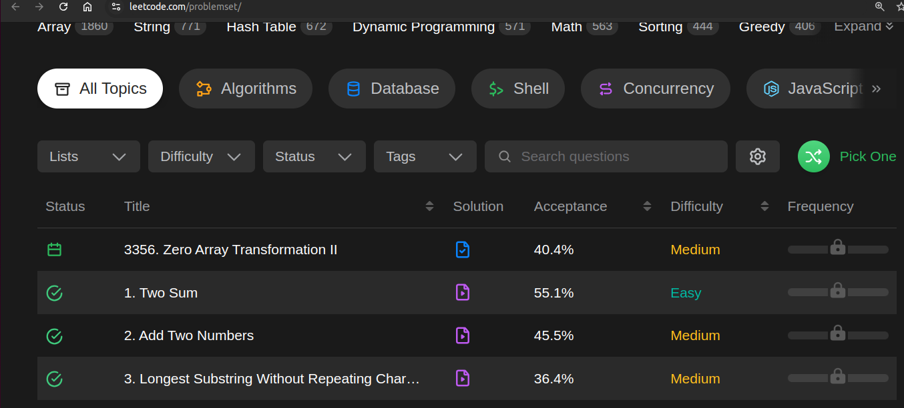

# Entrega de ejercicios LeetCode

Este archivo contiene las instrucciones y recomendaciones generales para la entrega de los ejercicios de LeetCode.

## Periodicidad
Se propondra un ejercicio para resolver cada semana en la sesión de laboratorio (jueves). 

### Plazos de entrega.

Se contará con una semana para resolver el ejercicio propuesto y hacer la entrega via correo a más tardar a medionoche del día anterior a la sesión de laboratorio.  

Durante la sesión de laboratorio donde se propone un ejercicio nuevo, se podra empezar a trabajar en la resolución del problema y se contara con el espacio para aclarar dudas e inquietudes de este u otros ejericios adicionales propuestos.


## Criterios de entrega.
La entrega de los ejercicios debe tener en cuenta los siguientes requerimientos.
### Documento a entregar.

Se debe entregar un archivo PDF en el que se consignen los siguientes elementos.
- **Nombre del ejercicio**: Se debe consignar el nombre del ejercicio propuesto.
- **Integrantes**: Especificar los integrantes que presentan la solución
- **Metodología**: Describir la metodología propuesta para la resolución del problema.
- **Solución del problema**: Se debe consignar la solución del problema propuesto, explicando el detalle de las secciones de codigo o recursos más importantes a tener en cuenta.
- **Código de la solución**: Se debe consignar el enlace al repositorio donde se aloje la solución. El cual debe estar debidamente comentado.
- **Ejemplos de ejecución**:  
Se deben consignar imagenes de algunos ejemplos de ejecución, pueden ser ejecutados en consola o con los testCases que se presentan en la platafora de LeetCode.  
En caso de que la solución se envie en LeetCode y sea aceptada adjuntar captura de pantalla donde se logre ver el usuario.
- **Conclusiones y retos**: Se debe consignar la conclusión de la solución propuesta y los principales retos que se presentaron para abordarlo.
- **Formato de entrega**: No es necesario entregar el documento bajo un formato especifico como IEE, APA, etc, siempre y cuando la inofrmación se presente de manera ordenada y sea de facil seguimiento.

### Canal de entrega.

Enviar via correo con el asunto "Entrega Ejercicio {NombreEjercicioLeetCode}".
Donde {NombreEjercicioLeetCode} hace referencia al nombre como aparece en la lista de problemas

**Ejemplo:** Si el ejercicio propuesto fuera "1. Two Sum", el asunto del correo sería.
"Entrega Ejercicio 1. Two Sum"



---
## Recursos adicionales.
### Ejemplo de archivos para trabajar en local una solución de LeetCode

LeetCode en su linea gratuita no permite guardar cammbios de código en la interfaz, por lo tanto se sugiere trabajar en local para ir probando la solución y poder guardar los cambios que se vayan generando.  
A continuación se deja el enlace a una carpeta ejemplo de un problema de leetcode trabajado en local.
- [Ejemplo carpeta local de trabajo Problema LeetCode](https://github.com/DanielPalominoS/ALSE_G2_2510/tree/main/EjerciciosPractica/SampleLeetCodeProject/LongestSubstring)

Se debe crear la carpeta build, crear los archivos cmake y compilar el proyecto cada vez que se tengan cambios que se quieran probar.
```
mkdir build
cd build
cmake ..
make
```


